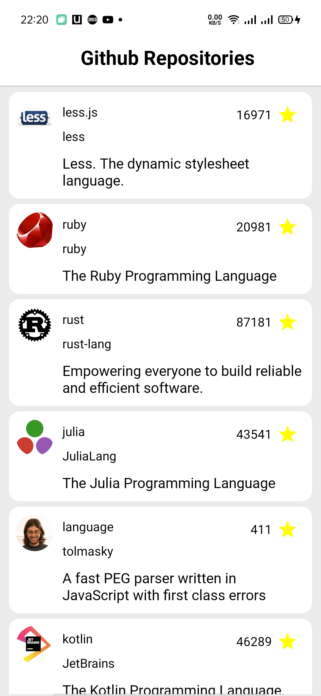
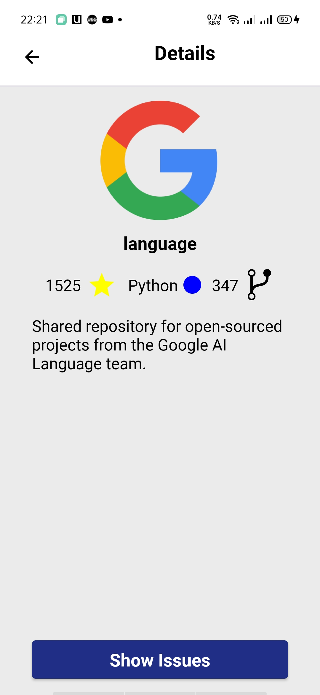
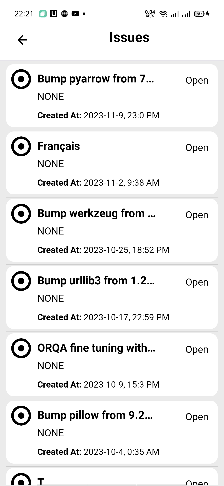
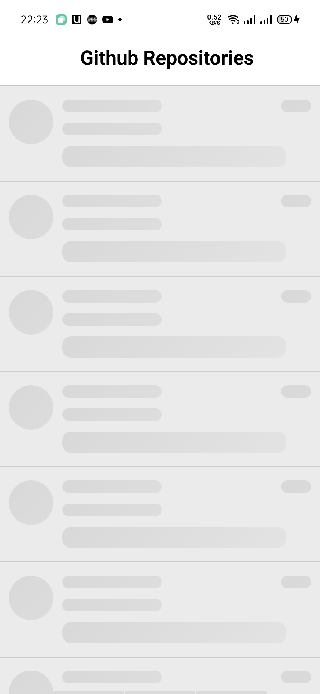
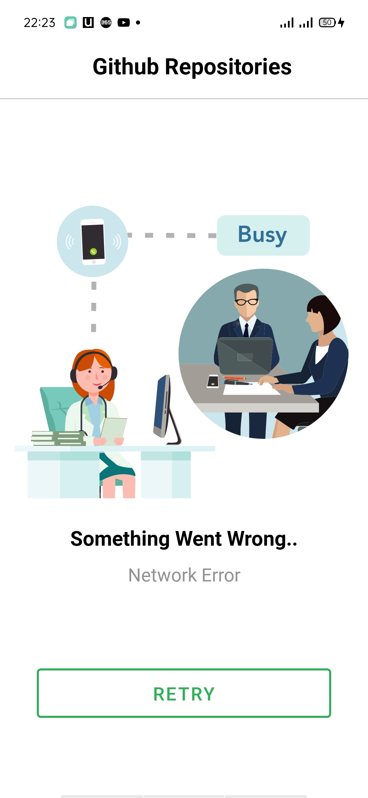
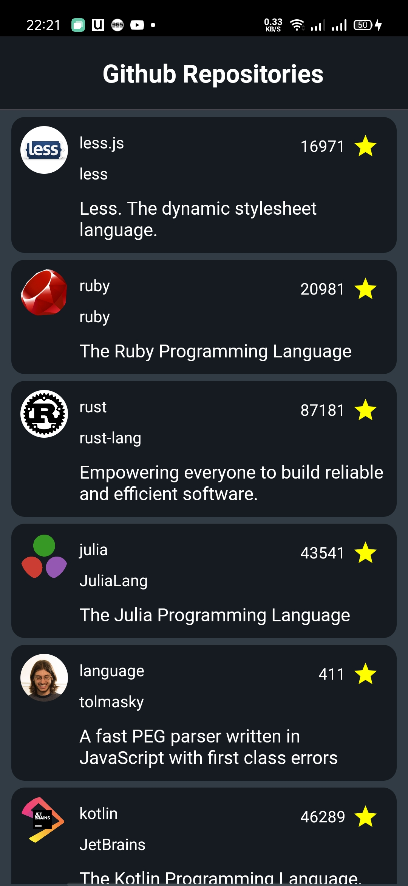
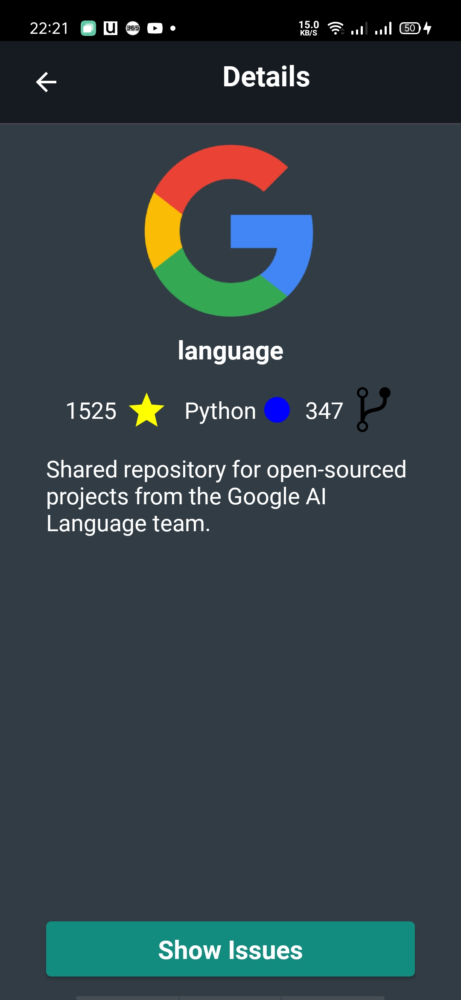
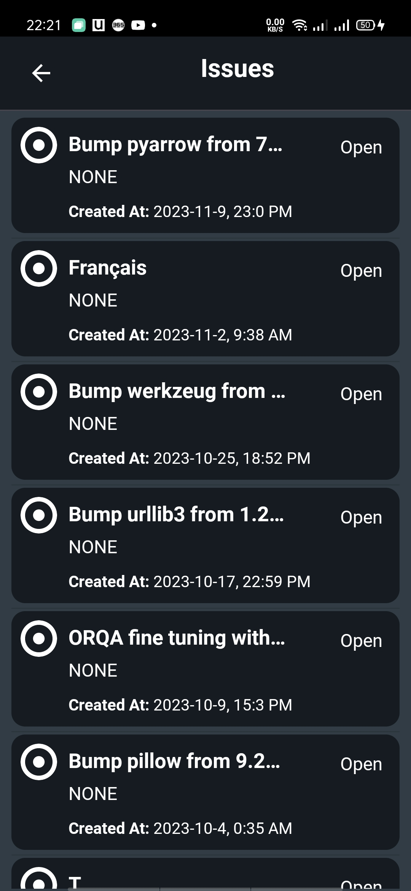
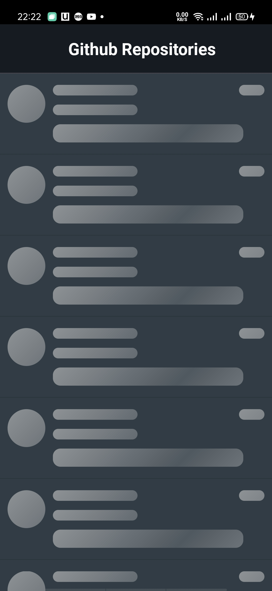
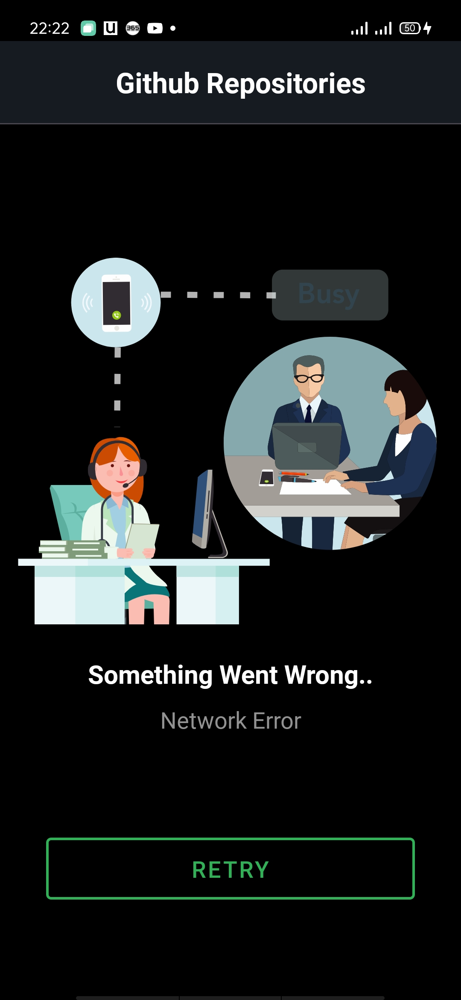

# Vodafone-Task (Githup repo viewer)
# Description
Your task is to develop a GitHub Repo Viewer app that allows users to view repositories from GitHub. 
The app should showcase your skills in Kotlin, Jetpack Compose, Coroutines, MVVM architecture, Retrofit for API calls to the GitHub API, Room Database for caching, and unit testing.

# Api Details
-	GitHub API Base URL: https://api.github.com
-	List Repositories: Get a list of repositorie.
    o	Endpoint:  repositories
    o	Example: /repositories
-	Get Repository Details: Get details about a specific GitHub repository.
    o	Endpoint: /repos/{owner}/{repo}
    o	Example: /repos/octocat/Hello-World
-	List Issues for a Repository: Get a list of issues for a specific GitHub repository.
    o	Endpoint: /repos/{owner}/{repo}/issues
    o	Example: /repos/octocat/Hello-World/issues

# Built with:
• Kotlin 
• Compose 
• Multi-Module MVVM Clean Architecture 
• Retrofit 
• OKHTTP3 
• Gson 
• Hilt 
• Coroutines 
• State Flow 
• Coil 
• ROOM 
• Paging 3 
• Chucker 
• Data Store 
• Lottie Animation 
• Mockk 
• Turbine 
• Compose UI Testing 

# Screen Shots

 
 

 
 
 
 

 
 

